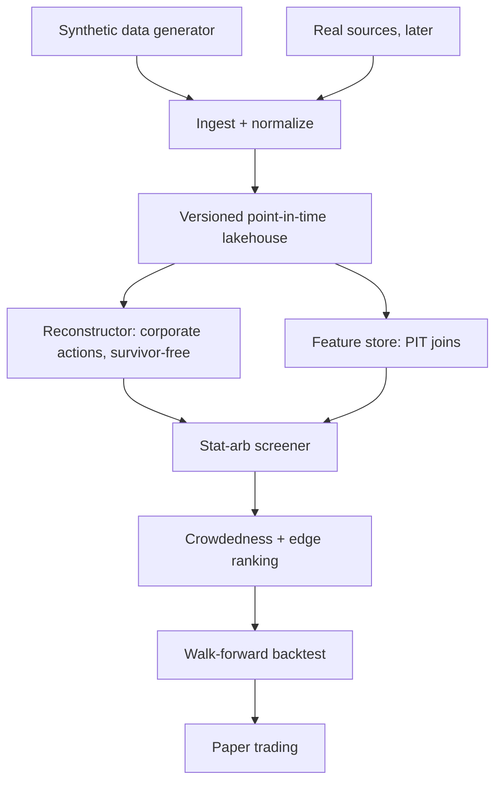

# MarketForge

A **real, usable tool for finding statistical-arbitrage opportunities in less
crowded markets** — backed by a point-in-time-correct market-data platform, so
the opportunities it surfaces are real and not backtest artifacts.

## The thesis: go where the edge is still there

Classic statistical arbitrage — cointegrated pairs and mean-reversion spreads on
large-cap, liquid names — is **crowded**: many funds run the same pairs, so the
edge is arbed away and what survives a backtest dies live (costs, slippage,
capacity, adverse selection). MarketForge targets **less crowded markets**
instead:

- **Less-covered equities** — small/mid caps, cross-listings, delisted-adjacent
  and regional names that carry thin analyst and institutional coverage.
- **Crypto, as a complement** — 24/7, retail-dominated, with many pair
  relationships (perp↔spot, cross-exchange, basket/rotation) and free tick data.

"Crowdedness" is a first-class signal, not an afterthought: the screener ranks
candidates by how much systematic money is already trading them, and prefers the
names everyone else is ignoring.

> **Guardrail:** paper-trade first, for months, with toy money you can afford to
> lose. The honest backtest-to-live gap is the product — not the P&L.

## Status

The repo currently implements the **foundation** (Phase 0): a deterministic,
seeded synthetic market-data generator with a ground-truth manifest, plus the
CLI, schemas, and CI that later phases build on. It is not yet a stat-arb
screener.

| Milestone | Status |
| --- | --- |
| M0.1 — repo, toolchain, devcontainer, CI, Makefile | ✅ done |
| M0.2 — seeded synthetic generator + ground-truth manifest | ✅ done (generator, manifest, schemas, determinism, and the crowdedness axis) |
| M1–M2 — lakehouse + historical reconstructor | ⬜ planned |
| M3 — tick processing + feature store | ⬜ planned |
| M4 — stat-arb screener + honest backtest (the point) | ⬜ planned |
| M5 — paper / toy-money trading | ⬜ planned |

See [`plan.md`](plan.md) for the full, phased plan and
[`docs/thoughts/`](docs/thoughts/) for the reasoning behind each decision.

## Architecture



The screener is the product; everything above it exists to make its output
trustworthy.

## Quickstart

```bash
# 1. Install Python 3.12 + dependencies
uv sync

# 2. Start Redpanda (the only daemon; DuckDB is embedded, no server)
make up

# 3. Generate synthetic data (deterministic: same seed -> identical bytes)
make gen

# 4. Verify the generated data against its ground-truth manifest
make verify

# 5. Ad-hoc SQL over the generated data
make duckdb

# 6. Full CI gate (lint + format + type + tests)
make ci
```

## Data model

| Dataset | Contents |
| --- | --- |
| `reference.parquet` | symbol, name, sector, listing date, currency, exchange |
| `bars.parquet` | daily open, high, low, close, and volume bars (raw, as-traded) + nullable `as_of` delivery time |
| `coverage.parquet` / `coverage.json` | crowdedness-axis ground truth: each symbol's tier (mega down to micro) with its latent market capitalisation and average daily volume |
| `manifest.parquet` / `manifest.json` | ground-truth log of every injected event |

The generator injects and records splits, dividends, delistings, symbol changes,
restatements, data gaps, bad ticks, and late/backfilled records — so later phases
have provable ground truth to reconstruct against. Volume and price are tiered
across the crowdedness axis, so the tier can be recovered from the bars alone;
the tier itself is recorded only in the coverage artifact.

## Environment

- **WSL2 + Ubuntu 24.04** (or the devcontainer), Docker inside.
- Python 3.12 via `uv`; single node is sufficient.

## Roadmap at a glance

| Phase | What it builds |
| --- | --- |
| 0 | Reproducible, seeded, testable synthetic data. |
| 1 | A versioned, point-in-time-correct lakehouse with quality gates. |
| 2 | Survivorship-bias + corporate-actions reconstruction, proven against ground truth. |
| 3 | Tick-scale features with no lookahead. |
| 4 | The stat-arb screener: less-crowded universe, cointegration, honest backtest. |
| 5 | Paper / toy-money trading with a journaled backtest-to-live gap. |
