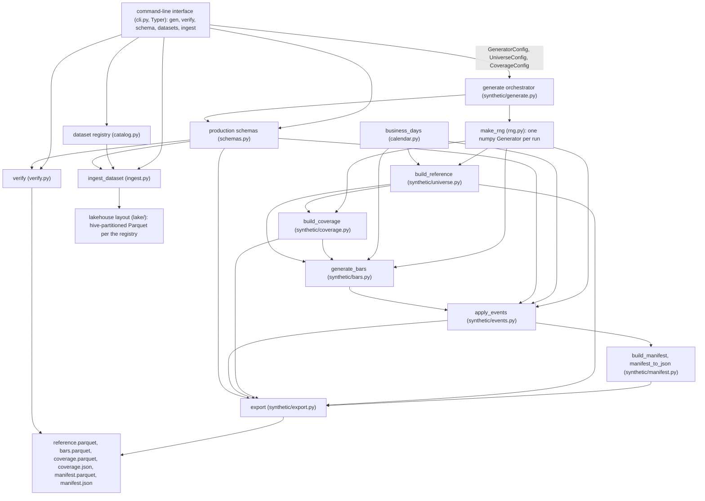
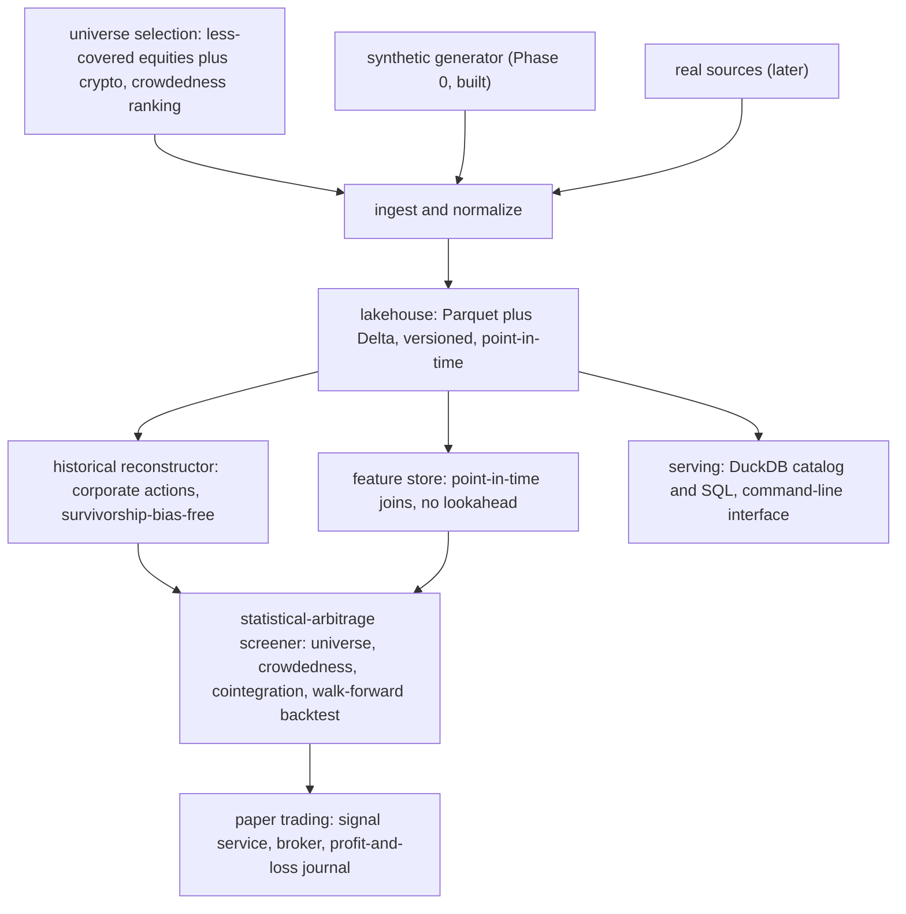

# MarketForge — Architecture Document

> **Status:** describes the repository as it exists in Phase 0 (foundations).
> This is a living document: any change that alters the architecture it describes
> must update it in the same pull request (see `agents.md`). The exact interface
> of every class, function, and data object lives in
> [`low-level-design.md`](low-level-design.md).

## 1. Purpose and scope

This document answers "what and why": which components exist, how they connect,
how data flows through them, and which invariants hold across the whole system.
The companion document [`low-level-design.md`](low-level-design.md) answers
"exactly how": the interface contract of every module, class, function, and
shared data object, down to types, ordering, and error behavior.
[`plan.md`](../plan.md) answers "what is next": the phases, milestones, and
acceptance criteria. The files in [`docs/thoughts/`](thoughts/README.md) answer
"why we chose this": the decision log.

## 2. System context

MarketForge is a tool for finding statistical-arbitrage opportunities in less
crowded markets. The tool is the product; the market-data platform underneath it
exists to make the tool's output trustworthy rather than merely plausible.

Two principles shape every architectural decision:

- **Honesty over profit.** The measured gap between a backtest and live trading
  is the real asset, not the profit-and-loss number.
- **The trust substrate.** The lakehouse, the historical reconstructor, and the
  feature store exist so that every surfaced opportunity is free of survivorship
  bias, correct as of the point in time, and honestly backtested.

The trading guardrail is architectural: the system paper-trades first, for
months, with toy money. Nothing in the architecture promises, builds, or implies
real-money trading.

## 3. Guiding principles

| Principle | What it means for the architecture |
| --- | --- |
| Less crowded is the edge | Universe selection and a crowdedness ranking are first-class components (Phase 4), not afterthoughts. |
| Correctness before scale | Point-in-time correctness, survivorship-bias handling, and corporate actions are solved on small synthetic data with provable ground truth before any scale is added. |
| Data as a product | Every dataset has a schema, a version, lineage, and a quality gate that blocks bad data rather than merely logging it. |
| Determinism | The same seed produces byte-identical artifacts everywhere, including continuous integration. |
| Reproducibility | A run is a pure function of its configuration; there is no hidden state and no wall-clock dependence. |

## 4. Current architecture (Phase 0)

Phase 0 is the foundations phase: a reproducible, seeded, testable synthetic
equity market-data generator with ground truth. Every later phase builds on top
of this component set.

### 4.1 Component diagram

The `verify` component reads the artifacts back from disk; it is the quality
check at the end of the loop, not a step inside the generator. The `ingest`
component reads the same artifacts and lands them in the lakehouse layout, per
the dataset registry's contract.

### 4.2 Component responsibilities

| Component | File | Responsibility | Consumes | Produces |
| --- | --- | --- | --- | --- |
| Configuration objects | `src/marketforge/config.py` | Frozen settings for one run: seed, universe window, crowdedness tiers, price model, event rates. | — | `UniverseConfig`, `CoverageConfig`, `GeneratorConfig` |
| Random number generation | `src/marketforge/rng.py` | Creates the one `numpy.random.Generator` a run draws from. | seed | `Generator` |
| Trading calendar | `src/marketforge/calendar.py` | Monday-to-Friday business-day list (no holiday table in Phase 0). | start and end dates | `list[date]` |
| Production schemas | `src/marketforge/schemas.py` | The stable PyArrow schemas, the fixed event-type order, and the name-to-schema map used by the registry. | — | schemas, field-order lists, `EVENT_TYPES`, `SCHEMAS`, `schema_signature` |
| Universe builder | `src/marketforge/synthetic/universe.py` | Deterministic reference table: tickers, names, sectors, listing dates. | `UniverseConfig`, random number generator, calendar | reference rows |
| Coverage builder | `src/marketforge/synthetic/coverage.py` | Assigns every symbol a crowdedness tier and its latent market capitalisation and average daily volume; slices the configured spans per tier; serializes the tier ground truth as JSON. | reference rows, `GeneratorConfig`, random number generator | coverage rows, coverage JSON document |
| Bar generator | `src/marketforge/synthetic/bars.py` | Raw as-traded daily bars (open, high, low, close, and volume) from a seeded geometric random walk, with tiered starting price and tier-anchored volume so the crowdedness axis is recoverable from observables. | reference and coverage rows, `GeneratorConfig`, random number generator, calendar | bar rows |
| Event injector | `src/marketforge/synthetic/events.py` | Decides, applies, and records corporate-action and data-quality events. | bar rows, reference rows, config, random number generator, `EVENT_TYPES` | mutated bars, event rows |
| Manifest builder | `src/marketforge/synthetic/manifest.py` | Serializes applied events as ground truth, in Parquet row form and as deterministic JSON. | event rows, seed | manifest rows, JSON document |
| Exporter | `src/marketforge/synthetic/export.py` | Writes the four tables as Parquet using the production schemas. | reference, bar, coverage, and manifest rows; output directory | `reference.parquet`, `bars.parquet`, `coverage.parquet`, `manifest.parquet` |
| Orchestrator | `src/marketforge/synthetic/generate.py` | Wires the pipeline in the fixed, deterministic order and writes the two JSON artifacts. | `GeneratorConfig`, output directory | the six artifact paths |
| Verifier | `src/marketforge/verify.py` | Re-reads the artifacts and checks schemas, bar invariants, coverage consistency and tier recoverability, and manifest consistency, resolving cross-event interactions through the manifest. | data directory | `(ok, report lines)` |
| Dataset registry | `src/marketforge/catalog.py` | Declares, per dataset: schema, version, partition columns, point-in-time field, and lineage; serializes to JSON and back for audit. | `SCHEMAS` | `DatasetSpec` objects, registry JSON |
| Ingestion | `src/marketforge/ingest.py` | Reads a source Parquet file, rejects schema mismatches against the registry contract, and lands the dataset in the lakehouse layout, hive-partitioned where the contract declares it. | dataset name, source directory, lakehouse directory | landed dataset path |
| Command-line interface | `src/marketforge/cli.py` | The `gen`, `verify`, `schema`, `datasets`, and `ingest` commands (Typer). | command-line options | printed output, exit codes |

### 4.3 The generation pipeline

The orchestrator (`generate`) fixes the data flow in this exact order; the order
is part of the byte-level determinism contract:

1. Create the single random number generator from the seed (`make_rng`).
2. Build the reference table (`build_reference`).
3. Assign crowdedness tiers and latent values (`build_coverage`).
4. Generate raw tiered bars (`generate_bars`).
5. Inject events into the bars and record them (`apply_events`).
6. Serialize the applied events into manifest records (`build_manifest`,
   `manifest_to_json`).
7. Write the Parquet artifacts (`export`) and the two JSON artifacts
   (`manifest.json`, `coverage.json`).
8. Optionally, verify the artifacts against the manifest and coverage
   (`verify`); optionally, land datasets in the lakehouse layout (`ingest`).

### 4.4 Determinism model

- **One generator per run.** `make_rng(seed)` creates a single
  `numpy.random.Generator`; every module receives it explicitly and draws from it
  in a fixed, documented order. The run is therefore a pure function of the seed
  and the configuration.
- **Explicit ordering everywhere.** Symbols are processed in sorted order, bars
  are sorted before export, and the manifest is serialized with sorted keys.
  No iteration over unordered containers determines output.
- **No hidden state, no wall clock.** The only time inputs are the configuration
  dates; `datetime.now()` and friends are not used.
- **Byte-identical output.** `tests/test_determinism.py` asserts that the same
  configuration writes identical bytes for all six artifacts, in different
  directories, and that a different seed differs.
- **Draw order is a contract.** Reordering random draws changes the bytes a seed
  produces. The low-level design documents the draw order per module so that any
  change to it is deliberate and recorded.

### 4.5 Data artifacts

| Artifact | Schema | Contents | Purpose |
| --- | --- | --- | --- |
| `reference.parquet` | `REFERENCE_SCHEMA` | One row per symbol: ticker, name, sector, listing date, currency, exchange. | The universe; later phases build point-in-time membership on it. |
| `bars.parquet` | `BARS_SCHEMA` | Raw as-traded daily bars with a nullable `as_of` delivery timestamp; volume and starting price are tiered across the crowdedness axis. | The price history the reconstructor will repair; the observables from which the crowdedness tier is recoverable. |
| `coverage.parquet` | `COVERAGE_SCHEMA` | One row per symbol: its crowdedness tier plus the latent market capitalisation and average daily volume behind it. | Ground truth for the crowdedness axis; deliberately a separate artifact, never a column of the production schemas. |
| `coverage.json` | — (deterministic JSON) | The tier list (most crowded first) and one entry per symbol, human-readable, sorted keys. | Inspectable tier ground truth; declares the tier order `verify` checks against. |
| `manifest.parquet` | `MANIFEST_SCHEMA` | One row per applied event, with a JSON payload. | Ground truth: proves reconstruction later. |
| `manifest.json` | — (deterministic JSON) | The same events plus the seed, human-readable, sorted keys. | Inspectable ground truth; byte-compared in determinism tests. |

The tick, quote, and event schemas are also defined in `schemas.py` as Phase 1
contracts, but the generator does not yet produce those datasets; they exist so
real sources can drop in later without schema churn.

### 4.6 The verification loop

`verify.py` re-reads all six artifacts and checks, in order:

1. All six files exist.
2. Each Parquet file's schema signature matches the production schema.
3. Bar invariants hold: no duplicate (symbol, date) rows, high is not below the
   larger of open and close, low is not above the smaller of them, low is
   positive, volume is non-negative.
4. Coverage is consistent: every reference symbol has exactly one coverage row
   with a declared tier, and the median daily volume per tier orders the tiers
   exactly as the coverage JSON declares them (the observable recovers the
   thin-to-crowded ordering).
5. Every manifest event is consistent with the data: splits satisfy price
   continuity, restatements and bad ticks are reflected exactly, late and
   backfilled records carry a future `as_of`, gaps are actually missing,
   delistings have no later bars, and symbol changes respect their boundaries.
   Cross-event interactions are resolved through the manifest: when a later
   recorded event removed or renamed the bar an earlier event points at, the
   absence is explained ground truth rather than a failure.

It returns `(ok, report lines)`; the command-line interface prints the report
and exits with code 1 when the check fails. The exact rules are in
[`low-level-design.md`](low-level-design.md#15-marketforgeverify).

### 4.7 Command-line surface

Five commands, reachable as `marketforge <command>` or
`python -m marketforge <command>`:

- `gen` — generate the artifacts into a directory (default `data/synthetic`).
- `verify` — check a generated dataset against its manifest and coverage.
- `schema` — print the production schemas.
- `datasets` — list the dataset registry: version, partitioning, point-in-time
  field, and lineage per dataset.
- `ingest` — land one generated dataset in the lakehouse layout per its
  registry contract (default `lake/`).

The exact options and exit codes are in
[`low-level-design.md`](low-level-design.md#18-marketforgecli-and-main).

## 5. Target architecture (phases 1 through 5)

The end state keeps the Phase 0 components as the generator and adds the trust
substrate around them. The screener stays the product.

| Phase | Component(s) built | Feeds on | Status |
| --- | --- | --- | --- |
| 0 | Synthetic generator with the crowdedness axis, ground-truth manifest and coverage, verification, command-line interface | — | Built |
| 1 | Lakehouse: milestone 1.1 is built (schema contracts, dataset registry, ingestion); storage, quality gates, orchestration, and serving remain planned | Phase 0 schemas and artifacts | M1.1 built; M1.2 through M1.5 planned |
| 2 | Historical reconstructor: corporate actions, survivorship-bias-free universes, point-in-time prices | Lakehouse, manifest ground truth | Planned |
| 3 | Tick processing and the feature store, plus the crypto universe | Lakehouse | Planned |
| 4 | Statistical-arbitrage screener: universe and crowdedness ranking, cointegration, walk-forward backtest, honest reporting | Reconstructor, feature store | Planned |
| 5 | Paper trading: signal service, broker integration, monitoring, the journaled backtest-versus-live gap | Screener | Planned |

The Phase 0 generator exports to the same PyArrow schemas real data will use, so
real sources can be dropped into the ingestion layer without schema churn. The
manifest is what makes Phase 2 provable: every injected split, dividend,
delisting, symbol change, restatement, gap, bad tick, and late or backfilled
record has a known answer to reconstruct against.

## 6. Cross-cutting invariants

These hold across every component and every phase; they are restated from
`agents.md` so the architecture document stands on its own.

1. **Schema evolution is deliberate and atomic.** Prefer adding fields over
   renaming or retyping; state what absence means for every new field; enforce
   required presence in the quality gate, not in storage nullability; carry the
   schema, the generator, verification, the tests, and the dataset registry in
   one pull request with the reason recorded.
2. **Determinism is a data property.** The same seed produces byte-identical
   artifacts everywhere.
3. **The manifest is ground truth.** Every applied event is recorded, and every
   recorded event was applied.
4. **Quality gates block.** Bad data is rejected, not just logged.
5. **Paper trading first.** The architecture serves a paper-trading loop with
   toy money; the deliverable is the honest backtest-to-live gap.

## 7. Runtime and environment

- **Package layout.** The Python package lives under `src/marketforge/`; the
  synthetic generator under `src/marketforge/synthetic/`. The console script
  `marketforge` is declared in `pyproject.toml` and points at
  `marketforge.cli:app`; `python -m marketforge` runs the same app.
- **Local single node.** The target platform is Linux — Windows Subsystem for
  Linux 2 (Ubuntu 24.04) or the devcontainer. Python 3.12 is managed with `uv`.
  Docker is used only for Redpanda (`make up`); DuckDB is embedded and
  in-process, never a long-lived container.
- **Development loop.** The Makefile wraps generation, verification, schema
  inspection, registry listing, ingestion, the DuckDB shell, and the full
  continuous-integration gate (`make ci` runs ruff, the format check, mypy, and
  pytest).
- **Continuous integration.** `.github/workflows/ci.yml` runs the full gate on
  every pull request.

## 8. Document map

| Document | Question it answers |
| --- | --- |
| [`plan.md`](../plan.md) | What is being built, in which phase, and what "done" means. |
| [`low-level-design.md`](low-level-design.md) | The exact interface contract between every class, function, and data object. |
| [`thoughts/`](thoughts/README.md) | Why each decision was made; the decision log. |
| [`agents.md`](../agents.md) | The rules coding agents must follow, including keeping these documents current. |
| [`README.md`](../README.md) | Current status and quickstart. |
